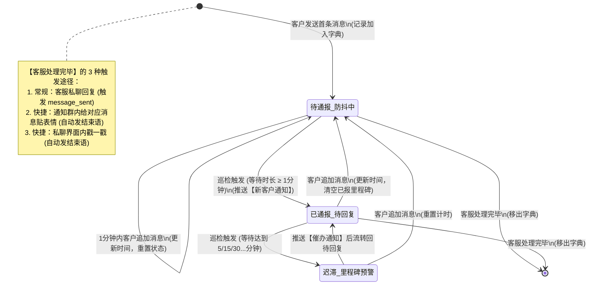

这段代码实现了一个非常经典的**客服会话状态机**，核心围绕 `unreplied_customers` 字典中客户的状态流转来展开，包含了防抖通报、超时升级（里程碑）、以及多种快捷结束途径。

为了让你更直观地理解它的运转逻辑，我为你绘制了以下状态机图表。你可以通过 Mermaid 渲染来查看：

### 状态流转详细解析

这段代码巧妙地通过 `last_active`、`is_newly_reported` 和 `reported_milestones` 三个变量控制了整个客户流转生命周期：

#### 1. 初始状态 -> 待通报_防抖中

- **触发事件**：客户（不在白名单内）发来私聊消息。
- **动作**：如果字典里没这个人，将其加入 `unreplied_customers`。
- **核心参数**：`is_newly_reported = False`，开始 1 分钟的防抖倒计时。

#### 2. 防抖重置 (防刷屏机制)

- **触发事件**：客户在未被客服回复前，继续发送消息。
- **动作**：刷新 `last_active` 为最新时间，并将 `msg_ids` 追加进去。清空之前所有已经记录的里程碑 `reported_milestones`。
- **意义**：以客户**最后一次**说话的时间为准重新计算等待时间，避免客户分多段发话导致频繁触发报警。

#### 3. 待通报 -> 已通报

- **触发事件**：后台死循环 `monitor_loop`（每 60 秒跑一次）检测到 `(当前时间 - last_active) >= 1 分钟` 且 `is_newly_reported == False`。
- **动作**：给内部群 `INTERNAL_GROUP_ID` 发送嵌套合并转发消息，随后将客户的 `is_newly_reported` 设为 `True`。

#### 4. 里程碑超时预警

- **触发事件**：后台死循环检测到等待时间跨过了 `MILESTONES` 中的阈值（如 5, 15, 30 分钟），且该阈值不在 `reported_milestones` 集合中。
- **动作**：发送超时催办通知，并将该阈值加入 `reported_milestones`，防止重复报警。

#### 5. 任何状态 -> 结束 (移出监控)

- **触发事件**：客服进行干预。
- **动作**：代码侦听到 `PrivateMessageEvent(post_type="message_sent")`（即机器人账号本身向该客户发送了消息）。
- **发生场景**：
1. 客服直接打字回复。
2. 客服在通知群给合并转发卡片**贴表情**（系统代发结束语，从而触发 `message_sent`）。
3. 客服在私聊里对该客户**戳一戳**（系统代发结束语，从而触发 `message_sent`）。
